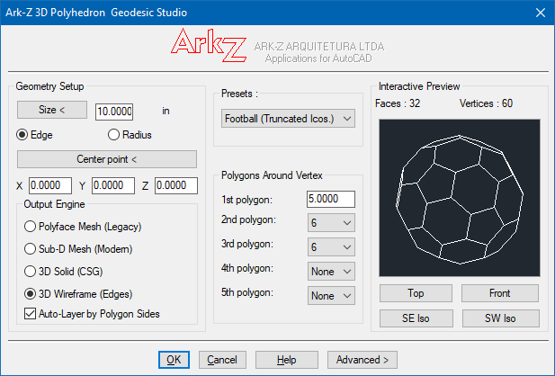
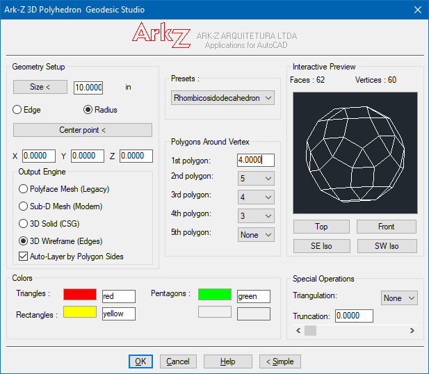
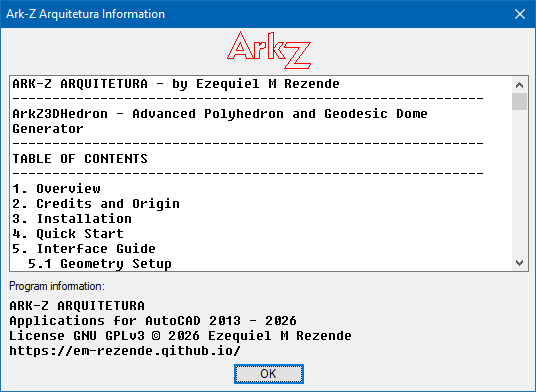

# ArkZ3DHedron Studio v3.2

**ArkZ3DHedron Studio** é uma ferramenta paramétrica avançada desenvolvida em **AutoLISP** e **DCL** para AutoCAD. Ele permite criar, visualizar e gerar poliedros complexos (Sólidos Platônicos, Arquimedianos, Catalans) e Domos Geodésicos diretamente no ambiente 3D do CAD.

O plugin conta com um motor de renderização vetorial próprio para visualização em tempo real (com suporte a remoção de linhas ocultas e sombreamento) e exporta em múltiplos formatos geométricos.

---

## 📸 Capturas de Tela

### Diálogo Principal — Visualização do Rombicosidodecaedro


*O diálogo principal exibindo um Rombicosidodecaedro (62 faces, 60 vértices) no preview vetorial interativo, com os painéis de Geometry Setup, Output Engine, Polygons Around Vertex, Colors e Special Operations.*

### Modo Avançado — Visualização do Icosaedro Truncado (Bola de Futebol)


*O diálogo Avançado exibindo um Icosaedro Truncado ("Bola de Futebol", 32 faces, 60 vértices) no modo 3D Wireframe com Auto-Layer ativado e atribuições de cores visíveis.*

### Diálogo de Ajuda


*O diálogo de Ajuda integrado, carregado a partir do ArkZ3DHedron.txt, mostrando o sumário e as informações de registro do programa.*

---

## 📜 Créditos e Origem

- **Autor Original:** Petri Leskinen
- **Data de Criação:** 8/12/2000 em Espoo, Finlândia
- **E-mail Original:** `leskinen.petri@luukku.com`
- **Desenvolvimento, Atualizações e Suporte ao Wireframe 3D (v3.2):** ARK-Z Arquitetura

---

## 📸 Recursos Principais

- 🧱 **4 Motores de Saída (Output Engines):**
  - **Polyface Mesh (Legacy):** Malhas tradicionais de polígonos 3D (compatibilidade universal).
  - **Sub-D Mesh (Modern):** Malhas subdivisíveis modernas nativas do AutoCAD.
  - **3D Solid (CSG):** Modelos sólidos reais criados via operações CSG e planos de corte (`SLICE`).
  - **3D Wireframe (Edges):** Estrutura de arame geométrica composta por **Polilinhas 3D (`3DPOLY`) fechadas** por face.
- 🎨 **Sistema Auto-Layer Inteligente:** Organiza automaticamente os elementos criados em camadas por número de lados (`3D_POLY_3SIDES`, `3D_POLY_4SIDES`, etc.) com cores padronizadas.
- 🖥️ **Preview Interativo em Tempo Real:**
  - Janela de preview vetorial com cálculo de faces visíveis/ocultas (*backface culling*).
  - Rotacionável via arraste do mouse.
  - Vistas rápidas (Topo, Frente, Isométricas SE e SW).
  - Modos **Wireframe** (Estrutura de Arame) e **Shade** (Sombreado colorido).
- 📐 **Presets Geométricos Integrados:**
  - **Sólidos Platônicos:** Tetraedro, Cubo, Octaedro, Dodecaedro, Icosaedro.
  - **Sólidos Arquimedianos:** Cuboctaedro, Rombicuboctaedro, Rombicosidodecaedro, Icosaedro Truncado ("Bola de Futebol").
  - **Sólidos de Catalan:** Dodecaedro Rômbico, Triacontaedro Rômbico, Hexaedro Tetráquico.
  - **Domos Geodésicos:** Frequências 1V, 2V e 3V baseadas em projeção esférica.
  - **Customizado:** Montagem livre definindo os polígonos ao redor do vértice.
- ⚙️ **Operações Geométricas Avançadas:**
  - **Truncamento (Truncation):** Ajuste de 0% a 50% para gerar poliedros truncados/duais.
  - **Triangulação:** Subdivisão recursiva de faces.
  - **Personalização de Cores:** Atribuição de cores de visualização por tipo de polígono.
- 💾 **Persistência de Configurações:** Gravação automática das últimas preferências de unidade, tamanho, modo de desenho e estado do Auto-Layer entre sessões do AutoCAD.

---

## 🛠️ Instalação Manual

1. Baixe os arquivos do programa na pasta do bundle `Fonts/Contents/Windows/`:
   - `ArkZ3DHedron.lsp` — AutoLISP codigo fonte
   - `ArkZ3DHedron.dcl` — Definição da diálogo da interface
   - `ArkZ3DHedron.slb` — Biblioteca de slide opcional
   - `ArkZ3DHedron.txt` — Ajuda em formato .txt
   - `ArkZ3DHedron.cuix` — Customização opcional de ribbon/barras de ferramentas
2. Copie os arquivos para uma pasta incluída nos caminhos de suporte do AutoCAD (*Support File Search Path*) ou mantenha-os na pasta de trabalho do projeto.
3. No AutoCAD, digite o comando `APPLOAD`.
4. Localize e selecione o arquivo `ArkZ3DHedron.lsp` e clique em **Load** (Carregar).

### Instalação Automatizada (Bundle / Instalador)

O Application Bundle completo do AutoCAD (`PackageContents.xml` + `Contents/`) fica armazenado na pasta `Fonts/`, exatamente no formato esperado pelo Autoloader do AutoCAD. Para compilar o instalador do Windows:

1. Instale o [Inno Setup 6](https://jrsoftware.org/isinfo.php).
2. Abra o arquivo `Install ArkZ3DHedron.iss` no Inno Setup Compiler e pressione **Compile**.
3. O executável de instalação é gerado na pasta `Instalador/` como `ArkZ3dhedron_v_<versao>_Setup.exe`.
4. Ao executar o setup, o bundle é instalado em `C:\Program Files (x86)\Autodesk\ApplicationPlugins\ArkZ3dhedron.bundle` (todos os usuários) ou `%APPDATA%\Autodesk\ApplicationPlugins\ArkZ3dhedron.bundle` (somente o usuário atual), fazendo com que o plugin seja carregado automaticamente na próxima inicialização do AutoCAD.

---

## 🚀 Como Usar

Digite o comando principal na linha de comando do AutoCAD:

```autocad
ArkZ3DHedron
```

A interface de diálogo (DCL) será exibida, permitindo configurar os parâmetros e visualizar o poliedro antes da geração.

---

## 📖 Guia de Interface e Recursos

### 1. Geometry Setup (Configuração Geométrica)

| Parâmetro | Descrição |
| --- | --- |
| **Size** | Define o tamanho base da geometria. Pode ser digitado ou capturado da tela pelo botão `Size <`. |
| **Edge / Radius** | Alterna se o valor de tamanho refere-se à **aresta do polígono** ou ao **raio da esfera circunscrita**. |
| **Center Point (X, Y, Z)** | Define a coordenada 3D de inserção do centro do poliedro. Pode ser indicado na tela pelo botão `Center point <`. |

---

### 2. Output Engine (Motores de Saída)

Escolha como a geometria será construída dentro do desenho:

* **Polyface Mesh (Legacy):** Cria entidades `PFACE`. Leve e compatível com versões antigas do AutoCAD e software de terceiros.
* **Sub-D Mesh (Modern):** Cria entidades `MESH` nativas. Ideal para quem pretende aplicar suavização de malha (*Smooth*) para modelagem orgânica.
* **3D Solid (CSG):** Gera um objeto `3DSOLID` real. Inicia a partir de um bloco sólido e aplica planos de corte (`SLICE`) nas faces calculadas.
* **3D Wireframe (Edges):** Cria apenas a malha de arame, gerando uma `3DPOLY` fechada em cada face. Ideal para detalhamento estrutural, eixos de centro ou gabaritos.
* **Auto-Layer by Polygon Sides:** Quando ativo, cria e atribui automaticamente layers nomeados de acordo com o número de lados do polígono (ex: `3D_POLY_3SIDES`, `3D_POLY_5SIDES`).

---

### 3. Presets e Customização

Selecione um poliedro pré-configurado na lista **Presets** ou monte uma topologia própria preenchendo a caixa **Polygons Around Vertex** com o número de lados dos polígonos que se encontram em cada vértice (ex: `3, 3, 3` para Tetraedro; `3, 4, 3, 4` para Cuboctaedro).

---

### 4. Interactive Preview (Visualização Vetorial)

* **Arrastar o Mouse:** Clique e arraste sobre o quadrado do preview para rotacionar o modelo dinamicamente em 3D.
* **Top / Front / SE Iso / SW Iso:** Botões de alinhamento rápido de vista.
* **View / Shade:** `View` exibe a estrutura em linhas com ocultação de faces traseiras. `Shade` preenche as faces com as cores atribuídas.

---

### 5. Modo Avançado (`Advanced >`)

Clique no botão **Advanced >** na parte inferior da janela para acessar os controles especiais:

* **Triangulation:** Subdivide recursivamente as faces em triângulos.
* **Truncation:** Controle deslizante para aplicar truncamento geométrico (ajustando os vértices em direção ao centro do poliedro).
* **Colors:** Permite atribuir cores ACI específicas por tipo de polígono (triângulos, quadrados, pentágonos, etc.) para visualização no modo sombreado.

---

## 📁 Estrutura de Arquivos do Projeto

```text
ArkZ3DHedron/
├── Fonts/                          # Application Bundle do AutoCAD
│   ├── PackageContents.xml         # Manifesto do bundle (Autoloader / App Store)
│   └── Contents/
│       ├── Resources/              # Ícones, folha de estilo, ajuda (Index.htm) e capturas de tela
│       └── Windows/                # ArkZ3DHedron.lsp, .dcl, .cuix, .slb e a ajuda .txt
├── Support/                        # Arte do instalador (ícone ARK-Z e bitmaps do assistente)
├── Instalador/                     # Pasta de saída do instalador compilado (.exe)
├── Install ArkZ3DHedron.iss        # Script Inno Setup do instalador do Windows
├── README.md                       # Documentação em inglês
└── README_ptBR.md                  # Documentação em português (Brasil)
```

---

## 📐 Compatibilidade

* **Softwares Suportados:** AutoCAD 2012 até as versões mais recentes (Windows).
* **Unidades Nativas:** Suporte a conversão e leitura automática da variável `INSUNITS` (mm, cm, m, inches, feet).
* **Dependências:** Nenhuma biblioteca externa necessária (utiliza bibliotecas nativas AutoLISP/Visual LISP e DCL).

---

## 📄 Licença e Uso

Baseado na rotina original `3Dhedron.lsp` de Petri Leskinen (2000). Código disponibilizado para uso livre e modificações em projetos arquitetônicos, de engenharia e modelagem 3D.
```

